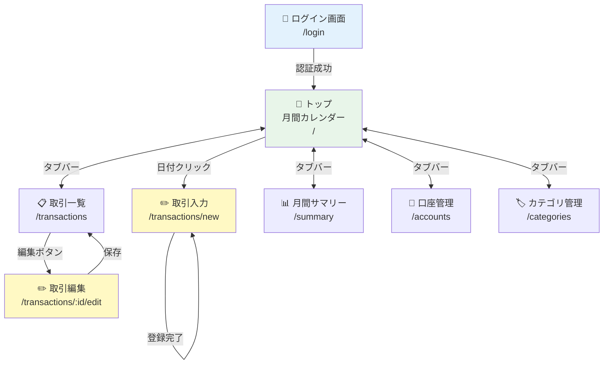
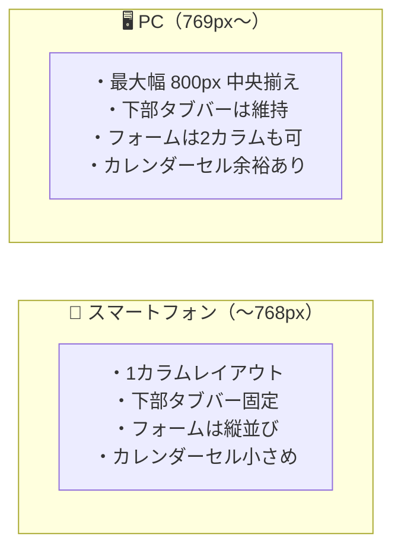

# Kakeibo ワイヤーフレーム

## 画面遷移図



---

## 共通レイアウト（ログイン後全画面）

```
┌─────────────────────────────────┐
│  Kakeibo        [表示名] [ログアウト] │  ← ヘッダー（固定）
├─────────────────────────────────┤
│                                 │
│                                 │
│          コンテンツ領域            │
│                                 │
│                                 │
├─────────────────────────────────┤
│  📅      📋      ➕      📊      ⚙️  │  ← タブバー（固定）
│ カレン  一覧    入力   サマリー  設定  │
└─────────────────────────────────┘
```

**タブバー項目：**

| アイコン | ラベル | 遷移先 |
| --- | --- | --- |
| 📅 | カレンダー | `/` |
| 📋 | 一覧 | `/transactions` |
| ➕ | 入力 | `/transactions/new` |
| 📊 | サマリー | `/summary` |
| ⚙️ | 設定 | 口座・カテゴリへのサブメニュー |

---

## 画面①：ログイン画面 `/login`

```
┌─────────────────────────────────┐
│                                 │
│            💰 Kakeibo           │
│          家計簿アプリ             │
│                                 │
│  ┌─────────────────────────┐    │
│  │  ログイン  │  新規登録   │    │  ← タブ切り替え
│  └─────────────────────────┘    │
│                                 │
│  ┌─────────────────────────┐    │
│  │ ユーザー名               │    │
│  └─────────────────────────┘    │
│                                 │
│  ┌─────────────────────────┐    │
│  │ パスワード               │    │
│  └─────────────────────────┘    │
│                                 │
│  ┌─────────────────────────┐    │
│  │        ログイン          │    │  ← プライマリボタン
│  └─────────────────────────┘    │
│                                 │
│  ⚠ エラーメッセージ（インライン）  │
│                                 │
└─────────────────────────────────┘
```

**新規登録タブ（追加項目）：**

```
│  ┌─────────────────────────┐    │
│  │ 表示名                   │    │  ← 追加
│  └─────────────────────────┘    │
│  ┌─────────────────────────┐    │
│  │ ユーザー名               │    │
│  └─────────────────────────┘    │
│  ┌─────────────────────────┐    │
│  │ パスワード（8文字以上+英数字）│    │
│  └─────────────────────────┘    │
│  ⚠ パスワード要件エラー          │  ← インラインエラー
│  ┌─────────────────────────┐    │
│  │        登録する          │    │
│  └─────────────────────────┘    │
```

---

## 画面②：トップ（月間カレンダー） `/`

### 季節イベント表示ルール

アプリはその年の以下の日付を自動計算し、該当月のカレンダーにバッジを表示する。

| イベント | 日付の計算方法 | バッジ表示例 |
| --- | --- | --- |
| 🎍 お年玉 | 毎年 1月1日 | `🎍お年玉` |
| 🌸 母の日 | 毎年 5月第2日曜日 | `🌸母の日` |
| 👔 父の日 | 毎年 6月第3日曜日 | `👔父の日` |

バッジのある日付をクリックすると、取引入力画面にそのカテゴリが初期選択された状態で遷移する。

---

### 今年の季節イベント支出サマリー

月切り替えの隣に、**今年1年分**の季節イベント支出を常時表示する。
表示する値はログインユーザーの当年の各カテゴリ合計金額。

```
┌──────────────────────────────────────────┐
│  ◀  2026年5月  ▶  │ 🎍¥20,000           │
│                   │ 🌸¥8,500  👔 未登録  │
└──────────────────────────────────────────┘
```

- 取引が1件もない場合は「未登録」と表示
- 金額は当年1月1日〜12月31日の合計

---

### 通常月（例：2026年3月）

```
┌─────────────────────────────────┐
│  Kakeibo          山田太郎 [ログアウト] │
├─────────────────────────────────┤
│                                 │
│  ┌─────────────────────────┐    │
│  │  💰 総残高               │    │
│  │     ¥ 245,000           │    │  ← 全口座合算
│  └─────────────────────────┘    │
│                                 │
│  ┌────────────────────────────────────┐ │
│  │ ◀  2026年3月  ▶ │ 🎍¥20,000      │ │  ← 月切り替え＋今年の支出
│  │                 │ 🌸¥8,500  👔未登録│ │
│  └────────────────────────────────────┘ │
│                                 │
│  月   火   水   木   金  土   日  │
│ ─────────────────────────────── │
│                              1  │
│  ─────────────────────────────  │
│  2    3    4    5    6   7    8  │
│       +500           -200       │
│  ─────────────────────────────  │
│  9   10   11   12   13  14   15  │
│  ─────────────────────────────  │
│  16  17   18   19   20  21   22  │
│  ─────────────────────────────  │
│  23  24   25   26   27  28   29  │
│  ─────────────────────────────  │
│  30  31                         │
│                                 │
├─────────────────────────────────┤
│  📅      📋      ➕      📊      ⚙️  │
└─────────────────────────────────┘
```

---

### イベントバッジあり月（例：2026年5月・母の日）

```
┌─────────────────────────────────┐
│  Kakeibo          山田太郎 [ログアウト] │
├─────────────────────────────────┤
│                                 │
│  ┌─────────────────────────┐    │
│  │  💰 総残高  ¥ 245,000   │    │
│  └─────────────────────────┘    │
│                                 │
│  ┌────────────────────────────────────┐ │
│  │ ◀  2026年5月  ▶ │ 🎍¥20,000      │ │
│  │                 │ 🌸未登録  👔未登録│ │  ← 母の日はまだ未登録
│  └────────────────────────────────────┘ │
│                                 │
│  月   火   水   木   金  土   日  │
│ ─────────────────────────────── │
│                   1    2   3    4│
│  ─────────────────────────────  │
│  5    6    7    8    9  10   11  │
│       +500  🌸母の日             │  ← 5/10（第2日曜）にバッジ
│  ─────────────────────────────  │
│  12  13   14   15   16  17   18  │
│  ─────────────────────────────  │
│  19  20   21   22   23  24   25  │
│  ─────────────────────────────  │
│  26  27   28   29   30          │
│                                 │
├─────────────────────────────────┤
│  📅      📋      ➕      📊      ⚙️  │
└─────────────────────────────────┘
```

---

### イベントバッジあり月（例：2026年1月・お年玉）

```
┌─────────────────────────────────┐
│  Kakeibo          山田太郎 [ログアウト] │
├─────────────────────────────────┤
│  ┌─────────────────────────┐    │
│  │  💰 総残高  ¥ 245,000   │    │
│  └─────────────────────────┘    │
│                                 │
│  ┌────────────────────────────────────┐ │
│  │ ◀  2026年1月  ▶ │ 🎍未登録       │ │  ← 元日なのでまだ未登録
│  │                 │ 🌸未登録  👔未登録│ │
│  └────────────────────────────────────┘ │
│                                 │
│  月   火   水   木   金  土   日  │
│ ─────────────────────────────── │
│       🎍お年玉  2    3    4   5  │  ← 1/1（元日）にバッジ
│  ─────────────────────────────  │
│  （以下省略）                    │
│                                 │
├─────────────────────────────────┤
│  📅      📋      ➕      📊      ⚙️  │
└─────────────────────────────────┘
```

---

**カレンダーセル詳細：**

```
┌────────────┐   ┌────────────┐
│ 10         │   │ 10         │  ← 通常セル
│ +¥3,000    │   │ 🌸 母の日   │  ← イベントバッジセル
│ -¥1,500    │   │ +¥3,000    │
└────────────┘   └────────────┘
  通常セル          イベントあり（バッジ優先表示）
```

> クリック時の動作：
>
> - 通常セル → 取引入力画面（日付のみ自動セット）
> - イベントバッジセル → 取引入力画面（日付 + 対応カテゴリが初期選択）

---

## 画面③：取引入力 `/transactions/new`

```
┌─────────────────────────────────┐
│  Kakeibo          山田太郎 [ログアウト] │
├─────────────────────────────────┤
│  取引を追加                       │
│                                 │
│  日付 *                          │
│  ┌─────────────────────────┐    │
│  │ 2026-05-15               │    │
│  └─────────────────────────┘    │
│                                 │
│  収支タイプ *                     │
│  ┌──────────┐ ┌──────────┐      │
│  │ ● 支出   │ │   収入   │      │  ← トグルボタン
│  └──────────┘ └──────────┘      │
│                                 │
│  カテゴリ *                       │
│  ┌─────────────────────────┐    │
│  │ 食費               ▼   │    │  ← 収支タイプに連動
│  └─────────────────────────┘    │
│                                 │
│  金額 *                          │
│  ┌─────────────────────────┐    │
│  │ ¥ 3,500                 │    │
│  └─────────────────────────┘    │
│  ⚠ 1円以上の整数を入力してください │  ← インラインエラー
│                                 │
│  口座 *                          │
│  ┌─────────────────────────┐    │
│  │ 楽天銀行           ▼   │    │
│  └─────────────────────────┘    │
│                                 │
│  備考（任意・100文字以内）          │
│  ┌─────────────────────────┐    │
│  │                         │    │
│  └─────────────────────────┘    │
│                                 │
│  ┌─────────────────────────┐    │
│  │        登録する          │    │  ← 登録後もこの画面に留まる
│  └─────────────────────────┘    │
│                                 │
│  ✅ 登録しました！（トースト通知）   │
│                                 │
├─────────────────────────────────┤
│  📅      📋      ➕      📊      ⚙️  │
└─────────────────────────────────┘
```

> **口座未登録の場合：**
> ```
> ⚠ 口座が登録されていません。
>   先に口座を登録してください → [口座管理へ]
> ```

---

## 画面④：取引一覧 `/transactions`

```
┌─────────────────────────────────┐
│  Kakeibo          山田太郎 [ログアウト] │
├─────────────────────────────────┤
│  取引一覧                         │
│                                 │
│  ── フィルター ─────────────────  │
│  収支  [すべて ▼]  口座 [すべて ▼] │
│  カテゴリ [すべて ▼]              │
│  備考キーワード [        🔍]      │
│  ─────────────────────────────  │
│                                 │
│  全 23 件                        │
│                                 │
│  ┌─────────────────────────────┐ │
│  │ 05/15  食費  楽天銀行        │ │
│  │        -¥ 3,500    スーパー  │ │
│  │                  [編集][削除]│ │
│  ├─────────────────────────────┤ │
│  │ 05/15  給料  楽天銀行        │ │
│  │       +¥ 250,000            │ │
│  │                  [編集][削除]│ │
│  ├─────────────────────────────┤ │
│  │ 05/12  交通費  Suica         │ │
│  │        -¥ 540    電車代      │ │
│  │                  [編集][削除]│ │
│  └─────────────────────────────┘ │
│                                 │
├─────────────────────────────────┤
│  📅      📋      ➕      📊      ⚙️  │
└─────────────────────────────────┘
```

**削除確認ダイアログ：**

```
┌─────────────────────────┐
│  この取引を削除しますか？  │
│                         │
│  05/15  食費  -¥3,500   │
│                         │
│  [キャンセル]  [削除する] │
└─────────────────────────┘
```

---

## 画面⑤：取引編集 `/transactions/:id/edit`

```
┌─────────────────────────────────┐
│  Kakeibo          山田太郎 [ログアウト] │
├─────────────────────────────────┤
│  取引を編集        [← 一覧に戻る]  │
│                                 │
│  日付 *                          │
│  ┌─────────────────────────┐    │
│  │ 2026-05-15               │    │
│  └─────────────────────────┘    │
│                                 │
│  収支タイプ *                     │
│  ┌──────────┐ ┌──────────┐      │
│  │   支出   │ │ ● 収入   │      │
│  └──────────┘ └──────────┘      │
│                                 │
│  カテゴリ *                       │
│  ┌─────────────────────────┐    │
│  │ 給料               ▼   │    │
│  └─────────────────────────┘    │
│                                 │
│  金額 *                          │
│  ┌─────────────────────────┐    │
│  │ ¥ 250,000               │    │
│  └─────────────────────────┘    │
│                                 │
│  口座 *                          │
│  ┌─────────────────────────┐    │
│  │ 楽天銀行           ▼   │    │
│  └─────────────────────────┘    │
│                                 │
│  備考（任意・100文字以内）          │
│  ┌─────────────────────────┐    │
│  │                         │    │
│  └─────────────────────────┘    │
│                                 │
│  ┌──────────┐ ┌──────────┐      │
│  │キャンセル │ │  保存する │      │
│  └──────────┘ └──────────┘      │
│                                 │
├─────────────────────────────────┤
│  📅      📋      ➕      📊      ⚙️  │
└─────────────────────────────────┘
```

---

## 画面⑥：月間サマリー `/summary`

```
┌─────────────────────────────────┐
│  Kakeibo          山田太郎 [ログアウト] │
├─────────────────────────────────┤
│                                 │
│  ◀  2026年5月  ▶               │
│                                 │
│  ┌─────────┐┌─────────┐┌──────┐ │
│  │ 収入合計 ││ 支出合計 ││ 収支  │ │
│  │¥270,000 ││ ¥62,000 ││+¥208K│ │
│  └─────────┘└─────────┘└──────┘ │
│                                 │
│  ── 支出内訳 ─────────────────── │
│                                 │
│       ［円グラフ］               │
│    食費 45%  交通費 12%          │
│    光熱費 8%  その他 35%         │
│                                 │
│  ┌─────────────────────────────┐ │
│  │ カテゴリ     金額      割合  │ │
│  ├─────────────────────────────┤ │
│  │ 食費      ¥28,000    45%   │ │
│  │ 交通費     ¥7,500    12%   │ │
│  │ 光熱費     ¥5,000     8%   │ │
│  │ その他    ¥21,500    35%   │ │
│  └─────────────────────────────┘ │
│                                 │
│  ── 収入内訳 ─────────────────── │
│  ┌─────────────────────────────┐ │
│  │ カテゴリ     金額            │ │
│  ├─────────────────────────────┤ │
│  │ 給料      ¥250,000         │ │
│  │ 副収入     ¥20,000         │ │
│  └─────────────────────────────┘ │
│                                 │
│  ── 口座別残高 ──────────────────│
│  ┌─────────────────────────────┐ │
│  │ 口座名      現在残高          │ │
│  ├─────────────────────────────┤ │
│  │ 楽天銀行   ¥200,000         │ │
│  │ Suica       ¥4,460         │ │
│  │ 現金       ¥40,540         │ │
│  ├─────────────────────────────┤ │
│  │ 合計      ¥245,000         │ │
│  └─────────────────────────────┘ │
│                                 │
├─────────────────────────────────┤
│  📅      📋      ➕      📊      ⚙️  │
└─────────────────────────────────┘
```

---

## 画面⑦：口座管理 `/accounts`

```
┌─────────────────────────────────┐
│  Kakeibo          山田太郎 [ログアウト] │
├─────────────────────────────────┤
│  口座管理                         │
│                                 │
│  ── 口座を追加 ─────────────────  │
│  口座名 *                         │
│  ┌─────────────────────────┐    │
│  │ 例：楽天銀行              │    │
│  └─────────────────────────┘    │
│                                 │
│  初期残高                         │
│  ┌─────────────────────────┐    │
│  │ ¥ 0                     │    │
│  └─────────────────────────┘    │
│                                 │
│  ┌─────────────────────────┐    │
│  │        追加する          │    │
│  └─────────────────────────┘    │
│                                 │
│  ── 登録済み口座 ──────────────── │
│  ┌─────────────────────────────┐ │
│  │ 楽天銀行                    │ │
│  │ 初期残高 ¥0  現在 ¥200,000  │ │
│  │                  [編集][削除]│ │
│  ├─────────────────────────────┤ │
│  │ Suica                       │ │
│  │ 初期残高 ¥5,000 現在 ¥4,460 │ │
│  │                  [編集][削除]│ │
│  └─────────────────────────────┘ │
│                                 │
├─────────────────────────────────┤
│  📅      📋      ➕      📊      ⚙️  │
└─────────────────────────────────┘
```

**削除確認ダイアログ：**

```
┌──────────────────────────────┐
│  口座を削除（アーカイブ）しますか？ │
│                              │
│  「楽天銀行」                 │
│                              │
│  ※ 過去の取引データは残ります  │
│  ※ 入力画面の選択肢から消えます │
│                              │
│  [キャンセル]  [アーカイブする] │
└──────────────────────────────┘
```

---

## 画面⑧：カテゴリ管理 `/categories`

```
┌─────────────────────────────────┐
│  Kakeibo          山田太郎 [ログアウト] │
├─────────────────────────────────┤
│  カテゴリ管理                     │
│                                 │
│  ── カテゴリを追加 ──────────── │
│  カテゴリ名 *                     │
│  ┌─────────────────────────┐    │
│  │ 例：習い事                │    │
│  └─────────────────────────┘    │
│                                 │
│  種別 *                          │
│  ┌──────────┐ ┌──────────┐      │
│  │ ● 支出   │ │   収入   │      │
│  └──────────┘ └──────────┘      │
│                                 │
│  ┌─────────────────────────┐    │
│  │        追加する          │    │
│  └─────────────────────────┘    │
│                                 │
│  ── 支出カテゴリ ──────────────── │
│  ┌─────────────────────────────┐ │
│  │ 食費          [デフォルト]   │ │
│  │ 日用品        [デフォルト]   │ │
│  │ 交通費        [デフォルト]   │ │
│  │ 娯楽費        [デフォルト]   │ │
│  │ 医療費        [デフォルト]   │ │
│  │ 光熱費        [デフォルト]   │ │
│  │ 家賃          [デフォルト]   │ │
│  │ 通信費        [デフォルト]   │ │
│  │ 保険料        [デフォルト]   │ │
│  │ その他支出    [デフォルト]   │ │
│  ├─────────────────────────────┤ │
│  │ 習い事                [削除] │ │  ← ユーザー追加分のみ削除可
│  └─────────────────────────────┘ │
│                                 │
│  ── 収入カテゴリ ──────────────── │
│  ┌─────────────────────────────┐ │
│  │ 給料          [デフォルト]   │ │
│  │ 賞与          [デフォルト]   │ │
│  │ 副収入        [デフォルト]   │ │
│  │ その他収入    [デフォルト]   │ │
│  └─────────────────────────────┘ │
│                                 │
├─────────────────────────────────┤
│  📅      📋      ➕      📊      ⚙️  │
└─────────────────────────────────┘
```

---

## レスポンシブ対応方針


